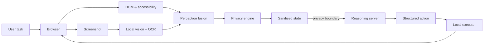

Aegis
Privacy-preserving on-device visual perception for lightweight browser agents.
Aegis is an experimental browser-agent runtime built for Smart India Hackathon 2026 — PS26171: On-device Visual Perception for Light-weight Browser Agents. It gives a browser agent useful visual and structural context while keeping sensitive information behind a trusted local privacy boundary.
> The core idea: **reason remotely when useful, but perceive, filter and enforce locally.**
Why Aegis
Conventional browser agents often send screenshots or page contents directly to a remote model. Those views can contain passwords, contact details, financial information, medical information, API keys and other data unrelated to the task.
Aegis inserts a trusted browser-side runtime between the page and the reasoning server:
```text
Browser page
   ├─ DOM / accessibility
   └─ screenshot
        ↓
Local perception
        ↓
Privacy engine
        ↓
Sanitized browser state
════════ PRIVACY BOUNDARY ════════
        ↓
Reasoning server / LLM
        ↓
Structured action JSON
        ↓
Local action execution
        ↓
Browser page
```
Aegis therefore controls two independent flows:
Information flow — what context may leave the browser.
Action flow — what structured actions may be executed in the browser.
Prototype capabilities
Chrome Manifest V3 extension with a side-panel interface
DOM and accessibility-aware page inspection
Local screenshot-based perception in an offscreen extension document
Image classification, object detection, OCR and text embeddings
DOM + vision fusion using bounding-box overlap (IoU)
Generalized sensitive-data detection cascade
Sensitivity classification and task-relevance assessment
Pass, pseudonymize, redact, omit and protective-proxy treatments
FastAPI reasoning server with an OpenAI-compatible provider interface
Session-aware multi-step agent loop
Structured actions such as click, type, scroll, select, hover, navigate, wait and key press
Local browser execution and action-result feedback
Demo appointment site for end-to-end testing
Architecture at a glance

Quick start
1. Build the extension
```bash
npm install
npm run build
```
Then open `chrome://extensions`, enable Developer mode, choose Load unpacked and select the generated `dist/` directory.
2. Start the reasoning server
```bash
python -m venv .venv
source .venv/bin/activate        # Windows: .venv\\Scripts\\activate
pip install -r server/requirements.txt
uvicorn server.main:app --reload --port 8000
```
The default configuration targets an OpenAI-compatible Ollama endpoint at `http://localhost:11434/v1`. Provider settings can be changed with environment variables; see the documentation for details.
3. Run a task
Open a webpage, open the Aegis side panel, inspect/perceive the page, enter a task and run either a single agent step or autonomous mode.
Documentation
The full developer documentation lives in `docs/` and is designed to publish automatically through GitHub Pages.
Key sections:
Getting started
Architecture
On-device perception
Privacy engine
Agent runtime
API and schemas
SIH evaluation
Demo walkthrough
Preview the docs locally
```bash
pip install -r requirements-docs.txt
mkdocs serve
```
Then open `http://127.0.0.1:8000`.
SIH evaluation focus
Criterion	Weight	Evidence area
Visual-context accuracy	25%	`docs/evaluation/visual-context-accuracy.md`
Sensitive/PII detection precision & recall	20%	`docs/evaluation/pii-detection.md`
Redaction precision	20%	`docs/evaluation/redaction-precision.md`
Client-side resource utilization	20%	`docs/evaluation/resource-utilization.md`
End-to-end latency	15%	`docs/evaluation/latency.md`
The evaluation pages intentionally contain editable result placeholders until the team freezes the final build and runs repeatable benchmarks.
Repository map
```text
extension/     Chrome extension: perception, privacy, UI and execution
server/        FastAPI reasoning server and session-aware agent planner
demo/          Local appointment demo used for end-to-end testing
docs/          Documentation source for GitHub Pages
scripts/       Build tooling
```
Status
Aegis is a hackathon prototype under active development. Architecture, model choices and benchmark numbers may change as the final SIH build is stabilized.
License
See LICENSE.
