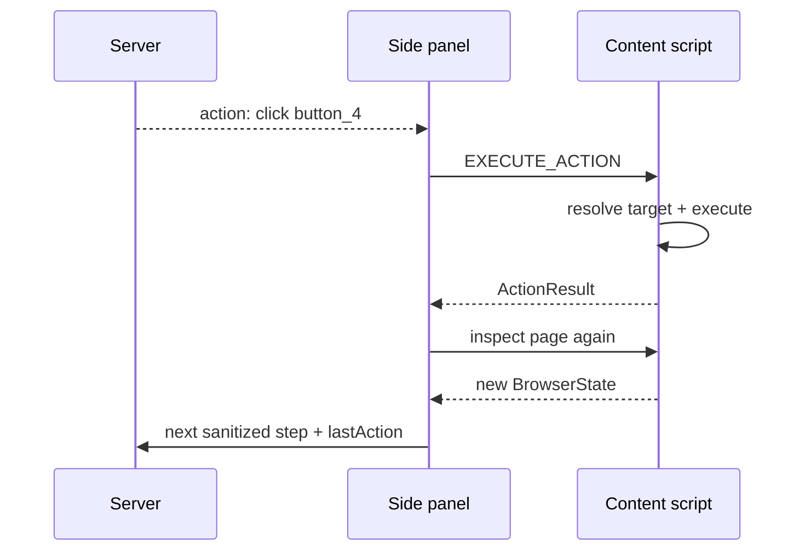

# Execution loop

The browser executes actions locally and reports success/failure back to the next reasoning step.

## Local executor

The current content-script executor resolves the Aegis element ID and supports native-like operations for clicking, typing, scrolling, selection, hover, navigation, waiting and key presses.

## Loop

## Failure feedback

An `ActionResult` contains:

- `success`
- action type
- optional target
- optional error
- timestamp

This gives the planner a chance to recover from a failed target or changed page rather than blindly continuing a stale script.
