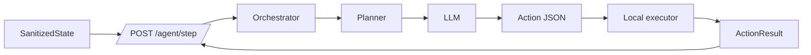

# Agent runtime

The agent runtime converts sanitized page state into one structured browser action at a time.

## Responsibilities

The server:

- validates the request schema
- maintains task/session history
- prepares the model prompt
- calls the configured LLM provider
- parses the response into an action
- marks task completion

The browser:

- owns observation
- owns privacy transformation
- owns action execution
- sends action results back on the next step

This split keeps the remote reasoning system outside the direct browser execution path.
