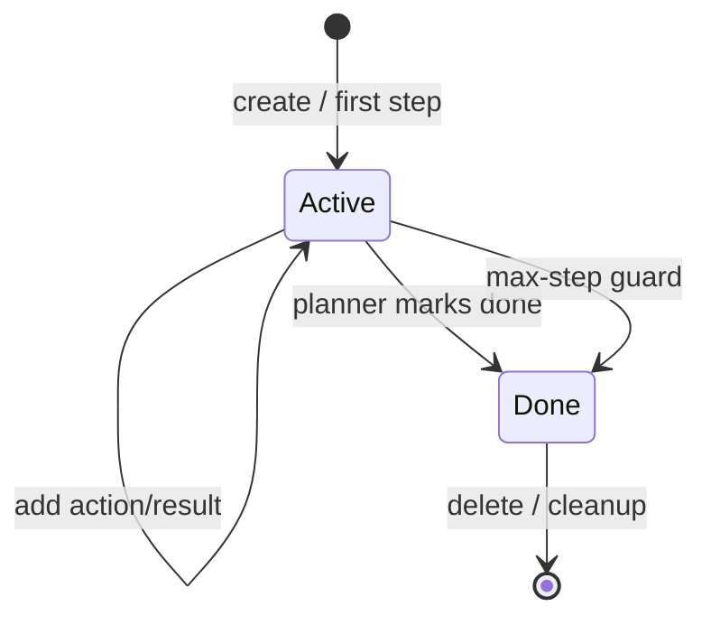

# Sessions

Aegis sessions provide continuity across multiple observe/reason/execute cycles.

## Session state

The server tracks:

- session ID
- task text
- current step
- action history
- action results
- completion status

Recent history is added to the planner context so the model can avoid repeating failed actions and understand progress.

## Session endpoints

```text
POST   /agent/sessions
GET    /agent/sessions
GET    /agent/sessions/{session_id}
DELETE /agent/sessions/{session_id}
```

See [HTTP API](../reference/api.md) for examples.

## Lifecycle



For a production design, session retention, concurrency and persistence policy should be explicit. The current prototype primarily uses in-memory session management for the running server process.
