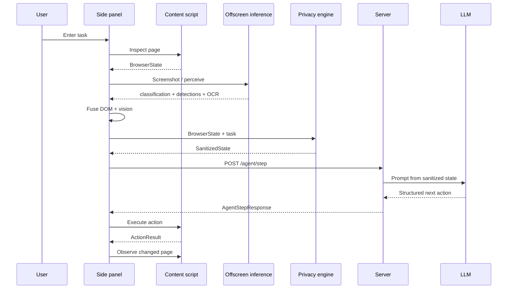

# Data flow

The most important architectural distinction in Aegis is the difference between **raw local state**, **sanitized outbound state** and **structured inbound actions**.

## Local data

May include page values, DOM attributes, the screenshot and the pseudonym mapping. These should remain inside the trusted extension boundary according to the final policy.

## Outbound data

The server contract contains:

- sanitized elements
- page information
- task text
- privacy statistics
- step number
- previous action result
- session identifier

See [Sanitized state](../reference/sanitized-state.md) and [HTTP API](../reference/api.md).

## Inbound data

The server returns one structured action with optional parameters, reasoning/status text, completion status and session identifier.
