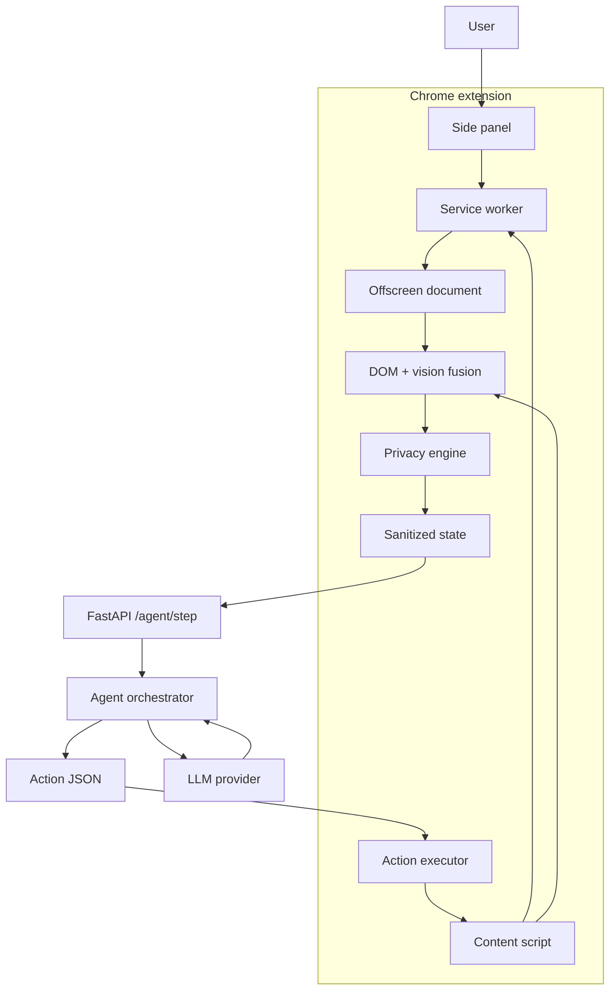

# Architecture overview

Aegis is a split browser/server system with a deliberately strong client-side role. Perception, privacy transformation and action execution remain local; remote reasoning consumes a sanitized state and returns a structured next action.

## Architectural principles

### Local-first observation
Raw page information is first processed inside the extension.

### Structured, minimum-necessary server context
The server contract is a schema, not a screenshot upload API.

### Narrow action surface
The reasoning layer selects from known action types rather than sending arbitrary JavaScript.

### Re-observe after execution
Each browser change feeds back into a new observation so planning remains grounded in the current page.

### Measurable pipeline
Perception latency, privacy outcomes, action outcomes and end-to-end timing can all be measured independently.

## Read next

- [System components](system-components.md)
- [Data flow](data-flow.md)
- [Extension runtime](extension-runtime.md)
- [Privacy pipeline](privacy-pipeline.md)
- [Server & agent](server-agent.md)
