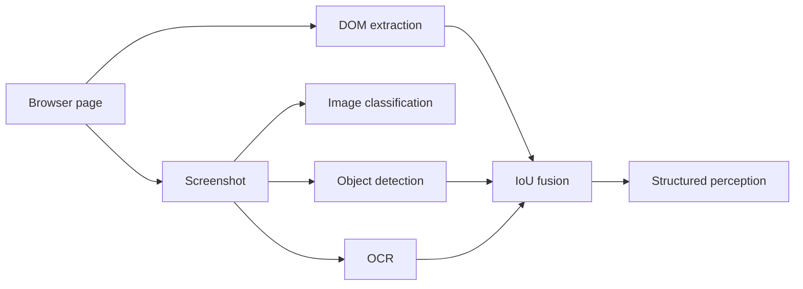

# Perception pipeline

Aegis combines structured page extraction with local visual inference.

## DOM path

The content script identifies interactive and semantically useful elements, assigns stable-in-observation IDs, derives accessible labels and records optional bounding boxes.

## Vision path

The offscreen document runs three perception tasks in parallel during a full perception request:

- image classification
- object detection
- OCR

## Fusion

Visual detections are normalized to element-like objects and compared with DOM bounding boxes using Intersection over Union (IoU). High overlap can confirm a match; lower overlap can remain as an independent signal.

The full details are in [Perception](../perception/overview.md).
