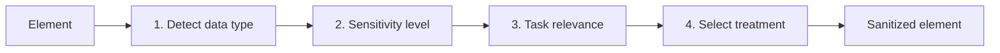

# Privacy pipeline

The privacy engine converts a rich local browser state into a server-facing sanitized state.

## Stage 1 — detection

A generalized cascade inspects standardized browser signals such as autocomplete, input type, accessible labels, nearby labels, placeholders and value patterns.

## Stage 2 — sensitivity

Each inferred data type maps to a sensitivity level from `0` to `4`.

## Stage 3 — task relevance

The user's task is used to classify data as `RELEVANT`, `CONDITIONAL` or `NEVER`.

## Stage 4 — treatment

The current treatment vocabulary is:

- `pass`
- `pseudonymize`
- `redact`
- `omit`
- `protective_proxy`

The final result is a `SanitizedState` plus counts showing how many elements received each treatment.

See [Privacy](../privacy/overview.md) for detailed rules.
