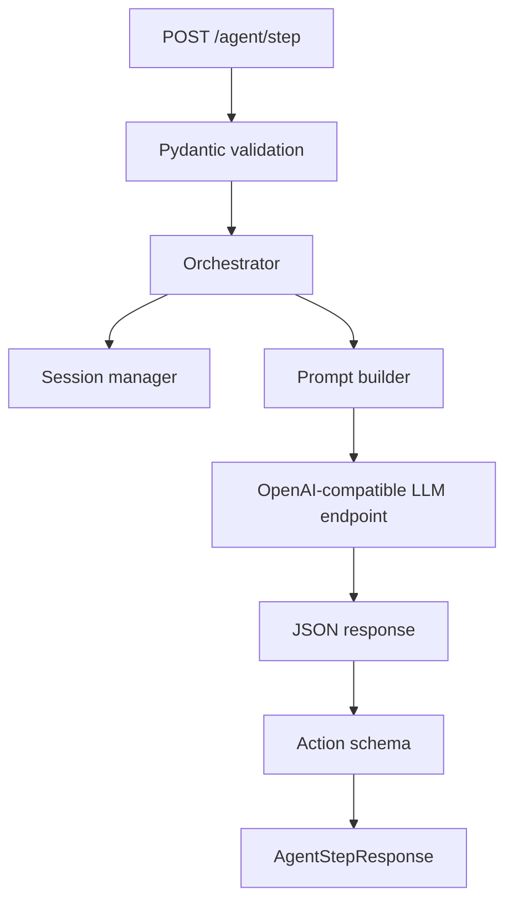

# Server and agent architecture

The server is intentionally smaller than the browser runtime. It accepts sanitized state, maintains step history and asks the configured reasoning model for **one next action**.

## Provider abstraction

The current planner calls an OpenAI-compatible `/chat/completions` endpoint. This allows local and hosted providers to share the same request path when they expose that interface.

## Prompt grounding

The prompt is assembled from:

- user task
- page metadata
- sanitized elements
- previous action result
- recent session history

## Step cap

The orchestrator has a maximum-step guard so a single task cannot run indefinitely on the server side.

## Completion

The model response may mark the task `done` and include a user-facing completion message. Otherwise the returned action is executed locally and the next observation begins.
