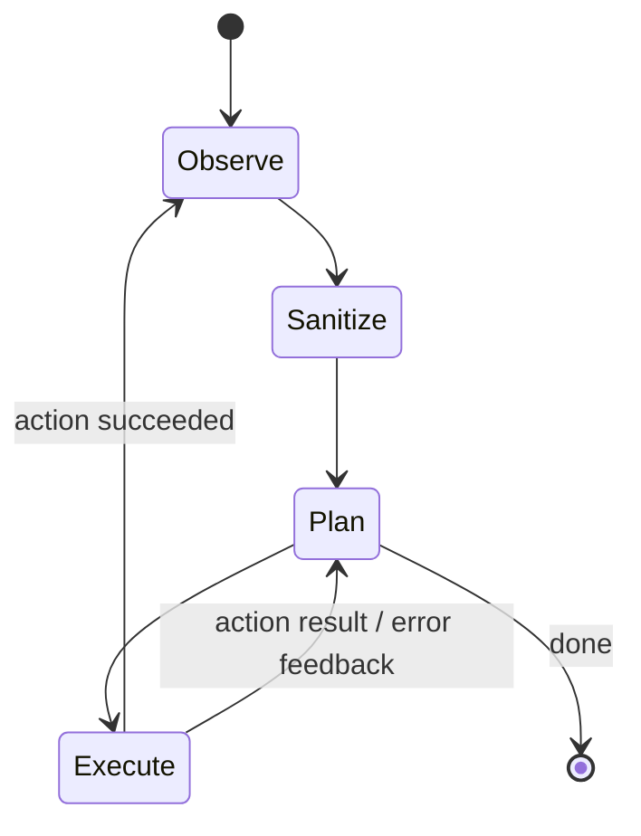

# Agent loop

Aegis performs browser tasks as a sequence of small, inspectable steps.

Each server call plans **one next action**. This keeps the browser in control of execution and gives the client a chance to re-observe the page after every state change.

## Why one action at a time

A long server-generated script can become invalid after the first click changes the page. A step-wise loop:

- reacts to dynamic interfaces
- records failures explicitly
- gives privacy logic another chance to evaluate the new page state
- limits the scope of each server response
- makes demos and debugging easier to explain

The server tracks session history so recent actions and results can be considered by the planner.
