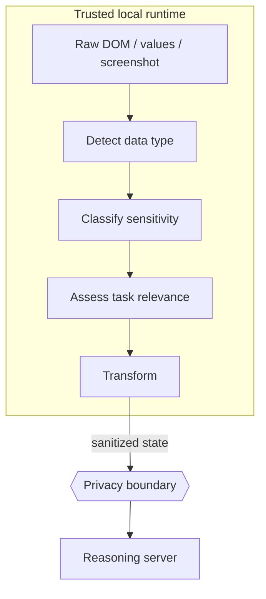

# Privacy boundary

The privacy boundary is the architectural line between **raw browser context** and **context that may be sent to the reasoning server**.

Aegis does not use a single "PII yes/no" flag. The privacy engine asks:

- What type of data is this?
- How sensitive is it?
- Is it required for the current task?
- What treatment exposes the least information while preserving task utility?

The answer may be to pass a value, replace it with a stable token, redact it, omit it or expose only a field status through a protective-proxy pattern.

!!! important
    Treat privacy claims as testable engineering properties. Final SIH documentation should only make categorical guarantees that are verified against the final build and network payloads.
