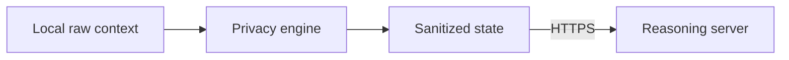

# Journey of a request

This page traces one representative Aegis task from user instruction to browser action.

> **Task:** “Book an appointment tomorrow at 10 AM.”

## 1. Observe

The content script creates a structured browser state:

```json
{
  "id": "button_4",
  "role": "button",
  "label": "Book Appointment",
  "visible": true
}
```

At the same time, the screenshot can be processed locally by the offscreen inference runtime.

## 2. Fuse perception

DOM and visual detections are spatially matched. A control seen by both sources can carry fused confidence/provenance.

## 3. Detect sensitive context

Form fields are classified through the detection cascade. Their data types are mapped to sensitivity levels.

## 4. Assess relevance

The booking task makes date/time controls relevant. Contact/payment fields may be conditional. Critical secrets remain locally protected according to policy.

## 5. Sanitize

The browser state becomes a server-facing `SanitizedState`.

```text
raw value → token / redaction / omission / proxy status
```

## 6. Cross the privacy boundary



## 7. Reason

The server constructs a prompt from the task, sanitized elements and recent action history. The configured model returns the next structured action.

```json
{
  "action": "click",
  "target": "button_4",
  "params": {}
}
```

## 8. Execute locally

The content script resolves `button_4`, performs the click and returns an `ActionResult`.

## 9. Re-observe

The page has changed, so Aegis observes and sanitizes again before asking for the next step.

## 10. Complete

The loop ends when the planner reports `done`, the step guard is reached or the user stops the agent.
