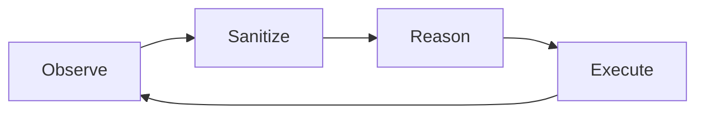

# First agent task

The repository includes a simple appointment demo at `demo/appointment-site/index.html`. Serve it locally or open it in a development web server, then use the extension side panel to inspect the page.

## Manual pipeline

A useful first pass is to run each stage independently:

1. **Inspect Page** — collect structured DOM/browser state.
2. **Perceive (Vision)** — capture the page and run local vision/OCR.
3. **Fuse DOM + Vision** — merge structural and visual detections.
4. **Sanitize (Privacy)** — preview the state that can be sent onward.
5. **Run Agent (Single Step)** — ask the server for one structured action.
6. **Execute Action** — execute the returned action locally.

This makes failures easy to isolate.

## Autonomous mode

Autonomous mode repeats the core loop:

The UI exposes a step limit so a task cannot loop indefinitely during testing.

## What to inspect

During a first task, watch four artifacts:

- **Element list** — what page structure was extracted.
- **Perception results** — what vision/OCR detected and how long it took.
- **Privacy results** — what was passed, pseudonymized, redacted, omitted or protected.
- **Agent response** — the action, target, parameters and completion status returned by the server.

Continue with [Request lifecycle](../demo/request-lifecycle.md) for a detailed end-to-end trace.
