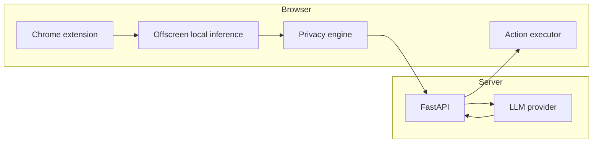

# Getting started

This section gets the Aegis prototype running locally: build the Chrome extension, start the FastAPI reasoning server and execute a first browser-agent task.

## What runs where

Aegis has two runtime halves:

The **browser extension is trusted** with raw page context. The **server should receive sanitized state**, not a raw screenshot dump.

## Recommended path

1. [Install the project](installation.md).
2. [Build and load the extension](running-extension.md).
3. [Start the server](running-server.md).
4. [Run a first agent task](first-task.md).

## Prerequisites

- Git
- Node.js and npm
- Python 3.10+ recommended
- Chromium/Google Chrome with extension Developer mode
- Optional: a local or remote OpenAI-compatible LLM endpoint

The repository also includes a `mock` provider so the server contract can be exercised without a production model.
