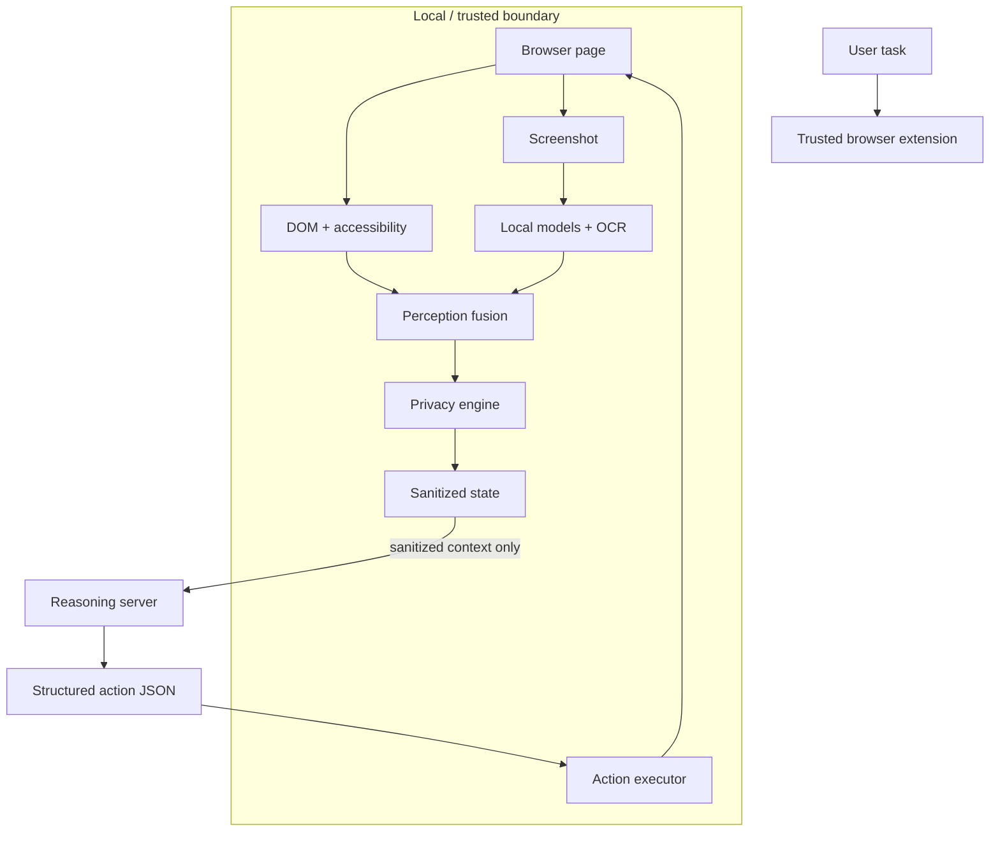

# Aegis

**Privacy-preserving on-device visual perception for lightweight browser agents.**

Aegis lets a browser agent understand the current page, remove or transform sensitive context locally and ask a reasoning model for a structured next action — without treating the raw browser as a data source the remote model may freely inspect.

[Get started](getting-started/overview.md){ .md-button .md-button--primary }
[Architecture](architecture/overview.md){ .md-button }

---

## The design in one diagram

Aegis is organized around two questions:

1. **What may the reasoning model see?** — handled by local perception, data classification and sanitization.
2. **What may the agent do?** — handled by a narrow action protocol and local execution.

## Explore Aegis

-   :material-eye-outline:{ .lg .middle } **Perception**

    ---

    Combine DOM structure, screenshots, local object detection and OCR into a structured view of the page.

    [:octicons-arrow-right-24: Perception pipeline](perception/overview.md)

-   :material-shield-lock-outline:{ .lg .middle } **Privacy**

    ---

    Detect data types, classify sensitivity, assess task relevance and choose the least-exposing treatment.

    [:octicons-arrow-right-24: Privacy engine](privacy/overview.md)

-   :material-robot-outline:{ .lg .middle } **Agent**

    ---

    Send sanitized state to a reasoning server and receive a small, structured browser action instead of executable code.

    [:octicons-arrow-right-24: Agent runtime](agent/overview.md)

-   :material-chart-box-outline:{ .lg .middle } **Evaluation**

    ---

    Measure the prototype against the SIH criteria for visual context, PII detection, redaction, resource use and latency.

    [:octicons-arrow-right-24: Evaluation](evaluation/overview.md)

## Prototype stack

| Layer | Current prototype |
|---|---|
| Browser runtime | Chrome Manifest V3 extension |
| Page structure | DOM + accessibility extraction |
| Visual runtime | Offscreen extension document |
| Local ML | Transformers.js + ONNX Runtime Web (WASM) |
| OCR | Tesseract.js |
| Fusion | IoU-based DOM/vision matching |
| Privacy | Detection cascade + sensitivity + relevance + treatment |
| Server | FastAPI + Pydantic |
| Reasoning interface | OpenAI-compatible chat-completions providers |
| Agent control | Structured JSON actions + local executor |

!!! note "Prototype documentation"
    These pages document the current repository snapshot while giving the team clear places to update model choices, measurements and final SIH behavior as the build evolves.

## Start here

If you are new to the project, continue with [Getting started](getting-started/overview.md). If you are reviewing the system for judging or architecture, start with [Architecture](architecture/overview.md) and [Request lifecycle](demo/request-lifecycle.md).
