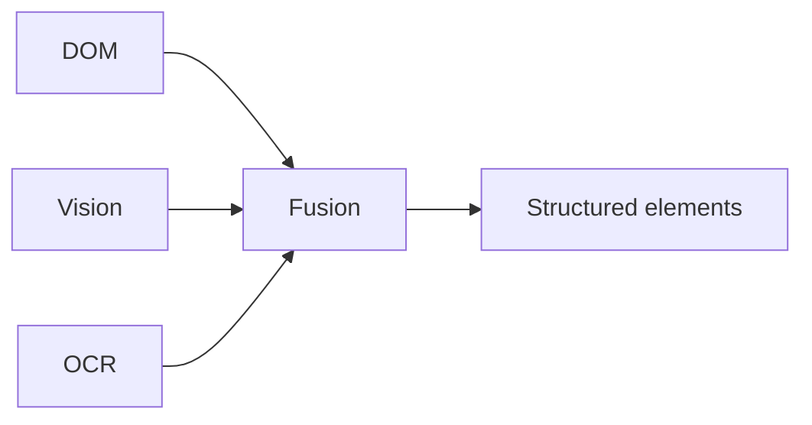

# Perception

Aegis perception answers a practical question: **what is currently on the page, and which parts can the agent interact with?**

The prototype uses two complementary sources:

- **DOM/accessibility perception** for structure, roles, labels and attributes.
- **Visual perception** for the rendered page surface, object detections and OCR.



## Perception output

A browser element can include:

```json
{
  "id": "button_4",
  "role": "button",
  "label": "Book Appointment",
  "tag": "button",
  "bbox": { "x": 420, "y": 650, "width": 160, "height": 40 },
  "visible": true,
  "sensitive": false,
  "sources": ["dom", "vision"]
}
```

The state is then handed to the privacy engine before the server sees it.

## Pages in this section

- [DOM extraction](dom-extraction.md)
- [Screenshot capture](screenshot-capture.md)
- [Local models](local-models.md)
- [OCR](ocr.md)
- [DOM + vision fusion](fusion.md)
