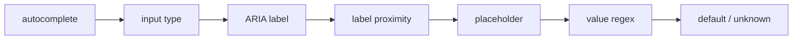

# Detection cascade

Aegis avoids relying on site-specific rules. Instead, it uses common HTML and accessibility signals to infer the type of data represented by an element.

## Cascade order

The current cascade checks signals in order:



Earlier, explicit browser metadata is generally stronger evidence than a value-pattern guess.

## Examples

| Signal | Example | Likely data type |
|---|---|---|
| `autocomplete="email"` | email input | `email` |
| `type="password"` | credential field | `password` |
| `aria-label="Phone number"` | phone control | `phone` |
| placeholder contains `UPI` | payment identity | `upi_id` |
| value regex matches card pattern | numeric value | `credit_card` candidate |

## Output

Each element receives a detection result:

```json
{
  "dataType": "email",
  "confidence": 0.95,
  "source": "autocomplete"
}
```

This inferred type is then mapped to sensitivity and relevance.

## Evaluation recommendation

Build a labeled field dataset containing both positive and difficult negative cases. Report per-type and aggregate precision/recall so a large number of easy public fields cannot hide poor performance on critical PII categories.
