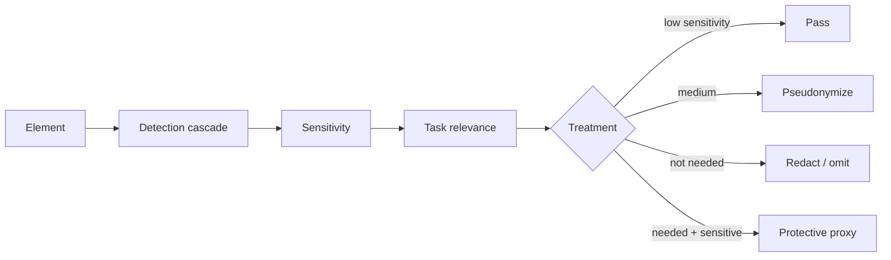

# Privacy engine

The privacy engine is the core control between local browser perception and remote reasoning.

For each element, Aegis determines:

1. **Data type** — what kind of value/control is this?
2. **Sensitivity** — how harmful would unnecessary exposure be?
3. **Task relevance** — does the agent need this information for the user's goal?
4. **Treatment** — what is the least-exposing representation that still preserves utility?

## Treatment vocabulary

| Treatment | Meaning |
|---|---|
| `pass` | value may be retained |
| `pseudonymize` | replace a value with a stable local token |
| `redact` | replace with a typed redaction marker |
| `omit` | do not include the value |
| `protective_proxy` | expose field status/semantics while keeping the real value local |

## Privacy modes

The current policy layer exposes `standard`, `strict` and `local-only` modes. See [Privacy modes](privacy-modes.md).
